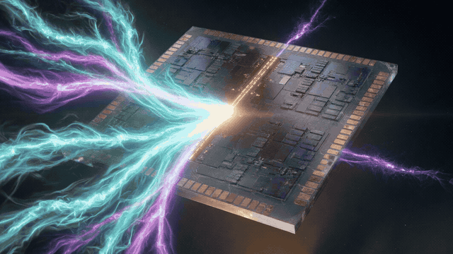

  

<h1 align="center">Helion</h1>

  Original FPGA family and the CAD that builds for it. 
  Apache-2.0 OR MIT · no vendor bitstream

  <a href="https://helion-fpga.github.io/helion/">Docs</a> ·
  <a href="https://helion-fpga.github.io/helion/use.html">Use</a> ·
  <a href="https://helion-fpga.github.io/helion/wiki.html">Wiki</a> ·
  <a href="https://github.com/helion-fpga/helion">CAD repo</a> ·
  <a href="https://helion-fpga.github.io/helion/get-involved.html">Get involved</a>

Helion is synth → pack → PathFinder → STA → `.hbits` plus a desktop IDE, all on the Helion Architecture Database. Gold: empty-XDC `examples/counter.sv` prints **`WNS_PS=9640`**.

| | |
|---|---|
| **Use the CAD** | [User guide](https://helion-fpga.github.io/helion/use.html) |
| **Build** | [Start](https://helion-fpga.github.io/helion/start.html) |
| **Wiki** | [Index](https://helion-fpga.github.io/helion/wiki.html) |
| **Help wanted** | [Issues](https://github.com/helion-fpga/helion/issues) · [Discussions](https://github.com/helion-fpga/helion/discussions/6) |
| **Sponsor** | [github.com/sponsors/saksham-45](https://github.com/sponsors/saksham-45) |

Owner: [@saksham-45](https://github.com/saksham-45).
